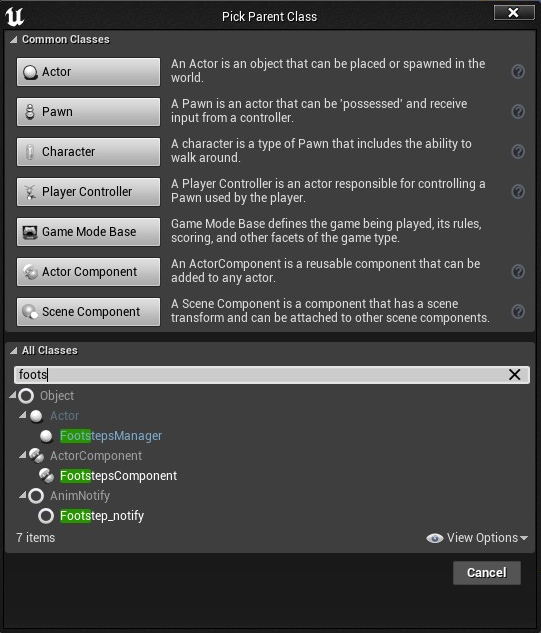

# What does it do?
it's Play a sound and Spawn a Particle and footprint under the associated bone or socket
specified in the animation using a custom animnotify that's control the size of the footprint and the partical.
## [See Footsteps Component Propertis](#footsteps-component-propertis)
## How To Setup:

##### 1.install and activate the plugin.

##### 2.go to Project Setting->Physics and add the surface type you want to the list.

##### 3.create a Physical Material for each surface type you added, and assign the corresponding surface type to each one.
 
##### 4.create a Data Table and pick the "FootstepsData" Row Struct.

 
 
##### 5.create a new row for each surface type and name it the same as the corresponding surface type. 
>. importnt and case sensitive.

   
##### 6.fill the Data Table with the Data you have. 
>. you could leave some effect empty.
>
>."Faded Dirty Footprint" is not Requaird and used only with "Dirty Rows".
##### 7.add a new Blueprint of type "FootStepsComponent".
 
##### 8.Set the Data Table to the Data Table you created.
 
##### 9.add the new FootStepsComponent you created to the actor you want. 
>.must have a Skeletal Mesh.
>
  
##### 10.in the class setting of the actor you added the FootStepsComponent to, add Footsteps Interface to the Interfaces section.
    
##### 11.right click on "Send Footstep Notification" and select Implement event. 
    
##### 12.search for and add the function "Add Footstep Effect" and connect the pins Like the Picture below. 
  
##### 13.open an animation sequence and add "Footstep_notify" at a frame you see the foot touch the ground.

##### 14.set "Bone Name" to the name of the foot touching the ground;

## Footsteps Component Propertis:
>. same as [Manager](#manager-the-manager-can-be-used-to-control-all-the-footstepscomponent-associated-withyou-can-use-different-managers-for-different-groubs-of-actors) Propertis.

##### Data Table: its where the effects categorized, it need to be of the "Footsteps Data" Row Struct.
##### Manager Class: select a Manager, to create a manager class create a new blueprint of type "FootStepsManager".

##### Manager: the Manager can be used to control all the "FootStepsComponent" associated with,you can use different managers for different groubs of actors.
##### you can set the values you want in the manager and every "FootStepsComponent" associated with it in the level will take its values from it.
>. manager is not necessary for the setup but its allow for more control.
>
>. the "FootStepsComponent" well spawn a manager of the specified class automatically if none are present in the level.
>>. if no manager class has been selected the "FootStepsComponent" well spawn a base class manager if none are present in the level.
>
>. Do Not Change Variables Value Directly!, use the functions in the "Footsteps Manager" Category.
>>. changing variables value directly will not update the actors using it.
##### Ignore Manager: if ignore Manager is checked the Component wont Use a Manager and its values can be changed independently.
#### Footsteps State: its self explanatory.
#### FadeOut:
##### Footprint Lifetime: how long will footprint last (in sec).
##### Footprint FadeOut Delay: how long will footprint take before starting to fadeout (in sec).
##### Footprint FadeOut Duration: how long will footprint take to fadeout (in sec).

#### Dirty Footprints:

## [Back](/README.md)
